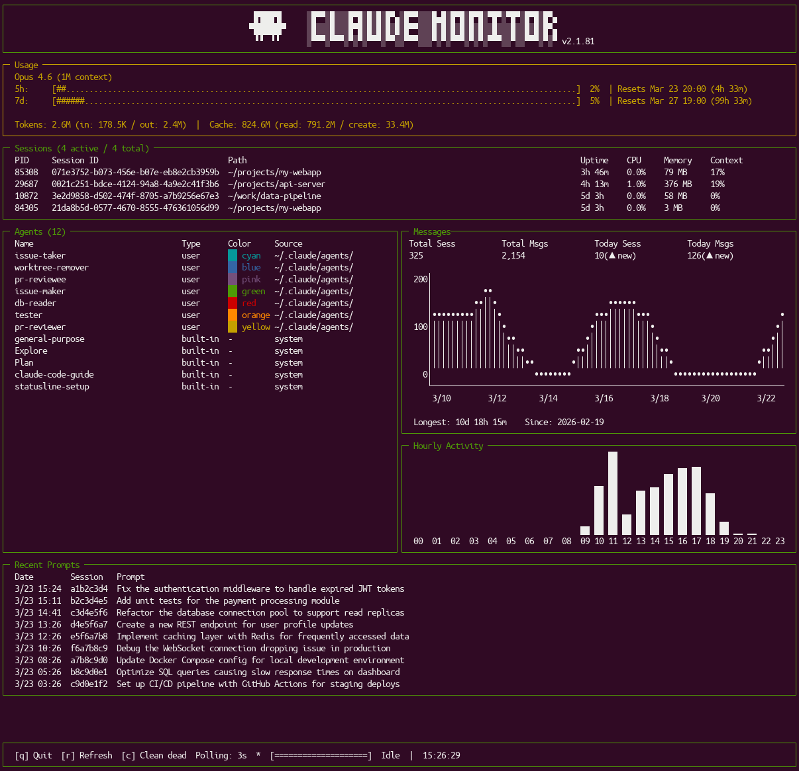

# Claude Monitor TUI

A real-time terminal dashboard for monitoring [Claude Code](https://docs.anthropic.com/en/docs/claude-code) sessions, API rate limits, token usage, and activity trends.

Claude Code의 세션, API 사용량, 토큰 소비량, 활동 트렌드를 실시간으로 모니터링하는 터미널 대시보드입니다.



---

## Requirements / 요구 사항

- [Bun](https://bun.sh/) runtime (v1.0+)
- [Claude Code](https://docs.anthropic.com/en/docs/claude-code) installed and configured (`~/.claude/` directory)
- `jq` command-line tool (for rate limit tracking)
- Terminal with Unicode support

---

## Setup & Run / 환경 세팅 및 실행

### 1. Install dependencies / 의존성 설치

```bash
bun install
```

### 2. Run / 실행

```bash
# Development mode (hot reload on file changes)
# 개발 모드 (파일 변경 시 자동 재시작)
bun run dev

# Production mode
# 프로덕션 모드
bun run start
```

### 3. Rate limit tracking setup / Rate Limit 추적 설정

On first launch, Claude Monitor automatically configures your `~/.claude/settings.json` to use its statusline script. **You must restart any running Claude Code sessions** for this to take effect.

처음 실행 시 `~/.claude/settings.json`에 statusline 스크립트가 자동으로 설정됩니다. **실행 중인 Claude Code 세션을 재시작해야** 적용됩니다.

If you want to set it up manually:

```json
// ~/.claude/settings.json
{
  "statusLine": {
    "type": "command",
    "command": "/absolute/path/to/claude-monitor-tui/scripts/statusline-rate-limits.sh"
  }
}
```

---

## Build Binary / 바이너리 빌드

Compile to a standalone executable using Bun:

Bun을 사용해 독립 실행 파일로 컴파일합니다:

```bash
bun build --compile src/index.ts --outfile claude-monitor
```

This creates a single `claude-monitor` binary with all dependencies bundled. Run it directly:

모든 의존성이 포함된 단일 `claude-monitor` 바이너리가 생성됩니다. 직접 실행할 수 있습니다:

```bash
./claude-monitor
```

### Cross-platform build / 크로스 플랫폼 빌드

```bash
# macOS ARM (Apple Silicon)
bun build --compile --target=bun-darwin-arm64 src/index.ts --outfile claude-monitor

# macOS Intel
bun build --compile --target=bun-darwin-x64 src/index.ts --outfile claude-monitor

# Linux x64
bun build --compile --target=bun-linux-x64 src/index.ts --outfile claude-monitor
```

---

## Dashboard Sections / 대시보드 섹션

### Logo

**EN:** Displays the Claude Monitor ASCII art logo with the current Claude Code version number. The logo centers dynamically based on terminal width.

**KR:** Claude Monitor ASCII 아트 로고와 현재 Claude Code 버전 번호를 표시합니다. 로고는 터미널 너비에 맞춰 자동으로 가운데 정렬됩니다.

---

### Usage (Rate Limits) / 사용량 (Rate Limit)

**EN:** Shows your current Claude API rate limit consumption across multiple time windows. This section helps you track how close you are to hitting rate limits, so you can pace your usage accordingly.

- **Model** — The Claude model currently in use (e.g., "Claude Opus 4.6")
- **5h** — 5-hour sliding window usage percentage with a gauge bar, reset time, and countdown
- **7d** — 7-day sliding window usage percentage with a gauge bar, reset time, and countdown
- **Sonnet** — Sonnet-specific rate limit window (shown only when applicable)
- **Tokens** — Cumulative token counts: total (input + output) and cache (read + create), formatted with K/M/B suffixes

**KR:** 여러 시간 구간에 걸친 Claude API Rate Limit 소비량을 표시합니다. Rate Limit에 얼마나 가까운지 추적하여 사용량을 조절할 수 있습니다.

- **Model** — 현재 사용 중인 Claude 모델 (예: "Claude Opus 4.6")
- **5h** — 5시간 슬라이딩 윈도우 사용률 (게이지 바 + 리셋 시간 + 카운트다운)
- **7d** — 7일 슬라이딩 윈도우 사용률 (게이지 바 + 리셋 시간 + 카운트다운)
- **Sonnet** — Sonnet 전용 Rate Limit 윈도우 (해당 시에만 표시)
- **Tokens** — 누적 토큰 수: 전체 (입력 + 출력) 및 캐시 (읽기 + 생성), K/M/B 접미사로 표시

> Updated every 3 seconds / 3초마다 갱신

---

### Sessions / 세션

**EN:** Lists all Claude Code sessions detected on your machine with live process statistics. Each row shows:

- **PID** — Operating system process ID
- **Session ID** — Unique Claude Code session identifier
- **Path** — Working directory of the session (shortened to fit terminal width)
- **Uptime** — How long the session has been running (e.g., "2h 15m")
- **CPU** — Current CPU usage percentage of the process
- **Memory** — Resident memory (RSS) in MB
- **Context** — Context window usage percentage (how full the conversation context is)

Dead (terminated) sessions are shown at the bottom with a `[DEAD]` marker. The panel height adjusts dynamically based on the number of sessions.

**KR:** 머신에서 감지된 모든 Claude Code 세션을 실시간 프로세스 통계와 함께 나열합니다. 각 행에는 다음이 표시됩니다:

- **PID** — 운영체제 프로세스 ID
- **Session ID** — Claude Code 고유 세션 식별자
- **Path** — 세션의 작업 디렉토리 (터미널 너비에 맞게 축약)
- **Uptime** — 세션 실행 시간 (예: "2h 15m")
- **CPU** — 프로세스의 현재 CPU 사용률
- **Memory** — 상주 메모리(RSS) MB 단위
- **Context** — 컨텍스트 윈도우 사용률 (대화 컨텍스트가 얼마나 찼는지)

종료된 세션은 하단에 `[DEAD]` 표시와 함께 나타납니다. 패널 높이는 세션 수에 따라 자동으로 조절됩니다.

> Updated every 3 seconds / 3초마다 갱신

---

### Agents / 에이전트

**EN:** Displays all available Claude Code agents — both built-in (e.g., Explore, Plan, claude-code-guide) and user-defined agents from `~/.claude/agents/`. Each entry shows:

- **Name** — Agent name
- **Type** — `built-in` or `user`
- **Color** — Agent's configured color with a colored preview block
- **Source** — Where the agent is defined (`system` or `~/.claude/agents/`)

This panel updates automatically when files in the agents directory change.

**KR:** 사용 가능한 모든 Claude Code 에이전트를 표시합니다 — 내장 에이전트(예: Explore, Plan, claude-code-guide)와 `~/.claude/agents/`의 사용자 정의 에이전트 모두 포함됩니다. 각 항목에는 다음이 표시됩니다:

- **Name** — 에이전트 이름
- **Type** — `built-in` 또는 `user`
- **Color** — 에이전트에 설정된 색상 (컬러 미리보기 블록 포함)
- **Source** — 에이전트 정의 위치 (`system` 또는 `~/.claude/agents/`)

에이전트 디렉토리의 파일이 변경되면 자동으로 갱신됩니다.

---

### Messages / 메시지

**EN:** Shows activity trends and historical statistics for your Claude Code usage.

- **Header stats** — Four summary metrics:
  - `Total Sess` — All-time total number of sessions
  - `Total Msgs` — All-time total number of messages
  - `Today Sess` — Today's session count with trend indicator (▲ increase / ▼ decrease / ━ unchanged vs. yesterday)
  - `Today Msgs` — Today's message count with trend indicator
- **14-day line chart** — ASCII line chart visualizing daily message counts over the past 14 days. Y-axis auto-scales, X-axis shows date labels (M/DD).
- **Footer** — Longest session duration ever recorded, and the date of your first Claude Code session.

**KR:** Claude Code 사용의 활동 트렌드와 이력 통계를 표시합니다.

- **상단 요약 지표** — 네 가지 요약 수치:
  - `Total Sess` — 전체 누적 세션 수
  - `Total Msgs` — 전체 누적 메시지 수
  - `Today Sess` — 오늘의 세션 수 + 트렌드 표시 (▲ 증가 / ▼ 감소 / ━ 동일, 어제 대비)
  - `Today Msgs` — 오늘의 메시지 수 + 트렌드 표시
- **14일 라인 차트** — 최근 14일간 일별 메시지 수를 ASCII 라인 차트로 시각화합니다. Y축은 자동 스케일, X축은 날짜 레이블(M/DD).
- **하단** — 가장 긴 세션 지속 시간, 최초 Claude Code 세션 날짜.

> Updated every 30 seconds / 30초마다 갱신

---

### Hourly Activity / 시간대별 활동

**EN:** A vertical bar chart showing message distribution across 24 hours (00–23). Uses Unicode block characters (▁▂▃▄▅▆▇█) to represent relative activity levels. Helps you identify your peak coding hours and usage patterns.

**KR:** 24시간(00–23)에 걸친 메시지 분포를 세로 막대 차트로 표시합니다. 유니코드 블록 문자(▁▂▃▄▅▆▇█)를 사용하여 상대적 활동 수준을 나타냅니다. 코딩 피크 시간대와 사용 패턴을 파악하는 데 도움이 됩니다.

> Updated every 30 seconds / 30초마다 갱신

---

### Recent Prompts / 최근 프롬프트

**EN:** Displays the 10 most recent user prompts across all sessions, newest first. Each entry shows:

- **Date** — Timestamp in M/DD HH:MM format
- **Session** — First 8 characters of the session ID
- **Prompt** — The prompt text (first line, truncated to fit terminal width)

CJK (Korean, Chinese, Japanese) characters are handled correctly for visual width calculations.

**KR:** 모든 세션에서의 최근 10개 사용자 프롬프트를 최신순으로 표시합니다. 각 항목에는 다음이 표시됩니다:

- **Date** — M/DD HH:MM 형식의 타임스탬프
- **Session** — 세션 ID의 앞 8자리
- **Prompt** — 프롬프트 텍스트 (첫 줄, 터미널 너비에 맞게 자름)

CJK(한국어, 중국어, 일본어) 문자의 시각적 너비가 올바르게 처리됩니다.

> Updated every 30 seconds / 30초마다 갱신

---

### Status Bar / 상태 바

**EN:** The bottom bar showing the current monitoring state and controls.

- **Keyboard shortcuts** — `[q]` Quit, `[r]` Manual refresh, `[c]` Clean dead session files
- **Polling** — Current polling interval (3s)
- **Refresh indicator** — Animated spinner and progress bar during data refresh, "Idle" when not refreshing
- **Last Update** — Timestamp of the most recent data refresh (HH:MM:SS)

**KR:** 현재 모니터링 상태와 컨트롤을 보여주는 하단 바입니다.

- **키보드 단축키** — `[q]` 종료, `[r]` 수동 새로고침, `[c]` 종료된 세션 파일 정리
- **Polling** — 현재 폴링 간격 (3초)
- **갱신 표시** — 데이터 새로고침 중 애니메이션 스피너와 프로그레스 바, 비활성 시 "Idle"
- **Last Update** — 가장 최근 데이터 갱신 시각 (HH:MM:SS)

---

## Data Sources / 데이터 소스

Claude Monitor reads from Claude Code's local state directories:

| Data | Source Path | Description |
|------|-------------|-------------|
| Sessions | `~/.claude/sessions/` | Active Claude Code session files |
| Agents | `~/.claude/agents/` | User-defined agent definitions |
| History | `~/.claude/history.jsonl` | Recent user prompt history |
| Usage | `~/.claude/projects/**/*.jsonl` | Session message and token data |
| Rate Limits | `.data/rate-limits-latest.json` | Current API rate limit status (written by statusline script) |
| Context | `.data/contexts/*.json` | Per-session context window usage (written by statusline script) |

---

## Keyboard Shortcuts / 키보드 단축키

| Key | Action |
|-----|--------|
| `q` / `Ctrl+C` | Quit the dashboard / 대시보드 종료 |
| `r` | Manual refresh all data / 전체 데이터 수동 새로고침 |
| `c` | Clean dead session files / 종료된 세션 파일 정리 |

---

## License

MIT
